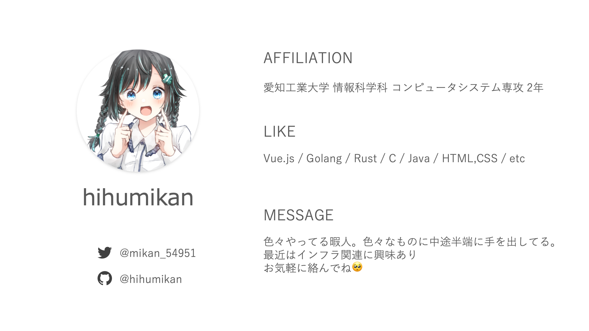

author: hihumikan
summary: Vue.jsの基本的な使い方の解説
id: vue-hihumikan-markdown
categories: codelab,markdown,vue,hihumikan
environments: Web
status: Published
feedback link: https://github.com/hihumikan/codelab-vue
analytics account: XXXXXXXX

# Vue勉強会 8 / 22 20~

# hihumikan - Vue勉強会 8 / 22 20~

## 待機スライド
Duration: 0:00:00

## はじめに
Duration: 0:03:00

### 話す事

- Webページの概要
- Vue.jsの基礎構文
- 公開手順
- ロードマップ

Positive
: ゴール

✅ Webアプリの大体の作り方の流れ

✅ Vueをなんとなく理解

Negative
: 話さない事

❌ Vueの細かい機能

❌ 他のフレームワーク、言語の比較

❌ HTML/CSSの説明

## 作るサンプル
Duration: 0:01:00

<button>
  [サンプル](https://qqey.net/)
</button>

## 自己紹介
Duration: 0:01:00

## Webページの概要
Duration: 0:06:00

### Webページについて

スマホやパソコン上で表示されているWebページは大体、**HTML/CSS/JavaScript**の３つの技術が用いられます。大まかにHTMLでWebページを作成し、CSSで見た目をデザイン、動きの部分でJavaScriptといった役割を持っています。

Webページを公開するだけならばHTMLとCSSで十分ですが、「**クリックした時にメッセージを表示させたい**」「**このツイートにいいねしたい**」「**画像が入れ替われるようにしたい**」などに、JavaScriptはよく利用されます。

つまり、条件によって色々変えたいとかプログラミングっぽいことをするならJavaScriptは必要になるということです。

### Vue.jsとは？

今回の勉強会のテーマとなっているVue.jsはそのJavaScriptの[フレームワーク](https://www.otsuka-shokai.co.jp/words/framework.html)となっており、通常のJavaScriptよりも**少ないコード**で開発出来たり、**簡単に保守**が出来たりするなど時間的コストを**大幅に短縮出来る**ソフトウェアです。

最近のWebアプリケーションの開発ではVue.jsが多くの企業で使われ、今人気のフレームワークとなっています。学習コストの低さもあるため、この機会にVue.jsを触ってみましょう。

※Vue.jsを使っているサイト一例

* note　
[https://note.com/](https://note.com/ )
* サイバーエージェント　[https://www.cyberagent.co.jp/](https://www.cyberagent.co.jp/)

他にも、ReactやAngular、JQuery、Svelteなどが存在しますが、今回の勉強会ではそれらの説明は割愛させて頂きます。興味があったら調べてみてね。

## VueでWebアプリを作成するステップ
Duration: 0:00:30

それでは、実際にWebアプリケーションを作成する方法を解説していきます。

ステップ毎に解説しております。

### STEP1:開発環境を整える

### STEP2:コードを書いてみる

### STEP3:GithubPagesにアップロードする

### STEP4:ページを公開する

一連の流れはこうなります。　次のページでSTEP1を解説していますので、NEXTを押してください。
