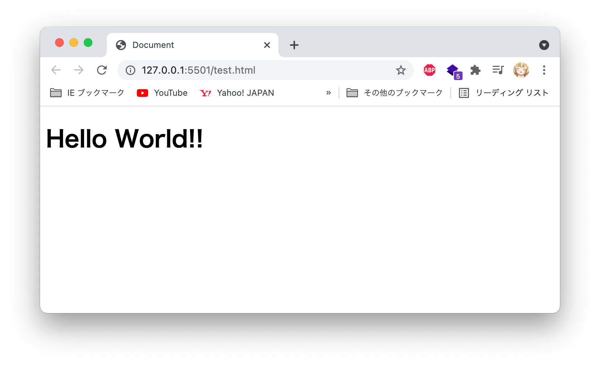

author: hihumikan
summary: Vue.jsの基本的な使い方の解説
id: vue-hihumikan-markdown
categories: codelab,markdown,vue,hihumikan
environments: Web
status: Published
feedback link: https://github.com/hihumikan/codelab-vue
analytics account: XXXXXXXX

# Vue勉強会 8 / 22 20~

# hihumikan - Vue勉強会 8 / 22 20~

## 待機スライド
Duration: 0:00:00


## はじめに
Duration: 0:03:00

### 話す事

- Webサイトの概要
- Vue.jsの基礎構文
- 公開手順
- 今後のステップアップ

Positive
: ゴール

✅ Webアプリの大体の作り方の流れ

✅ Vueをなんとなく理解


Negative
: 話さない事

❌ Vueの細かい機能

❌ 他のフレームワーク、言語の比較

❌ HTML/CSSの説明

## 作るサンプル
Duration: 0:01:00

<button>
  [サンプル](https://qqey.net/)
</button>


## 自己紹介
Duration: 0:01:00


## Webサイトの概要
Duration: 0:06:00

### Webサイトについて

スマホやパソコン上で表示されているWebサイトは大体、**HTML/CSS/JavaScript**の３つの技術が用いられます。大まかにHTMLでWebページを作成し、CSSで見た目をデザイン、動きの部分でJavaScriptといった役割を持っています。

Webサイトを公開するだけならばHTMLとCSSで十分ですが、「**クリックした時にメッセージを表示させたい**」「**このツイートにいいねしたい**」「**画像が入れ替われるようにしたい**」などに、JavaScriptはよく利用されます。

つまり、クリックによって色々変えたいとかプログラミングっぽいことをするならJavaScriptは必要になるということです。

### Vue.jsとは？

今回の勉強会のテーマとなっているVue.jsはそのJavaScriptの[フレームワーク](https://www.otsuka-shokai.co.jp/words/framework.html)となっており、通常のJavaScriptよりも**少ないコード**で開発出来たり、**簡単に保守**が出来たりするなど時間的コストを**大幅に短縮出来る**ものです。

最近のWebアプリケーションの開発ではVue.jsが多くの企業で使われ、今人気のフレームワークとなっています。学習コストの低さもあるため、この機会にVue.jsを触ってみましょう。

※Vue.jsを使っているサイト一例

* note　
[https://note.com/](https://note.com/ )
* サイバーエージェント　[https://www.cyberagent.co.jp/](https://www.cyberagent.co.jp/)
* Geartics　[https://www.geartics.com/](https://www.geartics.com/)


他にも、Vue.jsに対抗するライブラリやフレームワークなどがあり、ReactやAngular、JQuery、Svelteなどが存在します。今回の勉強会ではそれらの説明は割愛させて頂きますが、興味があったら調べてみてね。特にReact。

## Vueの解説ステップ
Duration: 0:00:30

それでは、実際にWebアプリケーションを作成する方法を解説していきます。

ステップ毎に解説しております。

### STEP1: 開発環境を整える

### STEP2: HelloWorldしてみる

### STEP3: カウントアップアプリを作る

### STEP4: GithubPagesに公開

次のページでSTEP1を解説していますので、Nextを押してください。

## STEP1:開発環境を整える
Duration: 0:05:00

### Vue.jsの種類

Vue.jsを使って開発する場合、**CDNを利用する方法**と**Vue CLIを利用する方法**の2種類存在します。

CDNの場合、htmlファイルに**scriptタグを読み込ませるだけ**。開発環境を整えなくても利用することができます。

Vue CLIの場合、Vue.jsの基本機能に加えて、**開発環境をすぐに作れる**優れもの。**色々な拡張機能を追加**できて、基本的にはこっちが利用される。

ただし、Vue CLIを利用するには**Node.jsをインストールする必要**があり、時間の都合上、今回の勉強会では、Vue.jsの基本機能を簡単に試せるCDN版を利用します。

### エディタについて

今回はオンラインエディタを利用して、Vue.jsを使用します。下記のリンクを踏んでいただき、こちらでコードを書いていただく形となります。

**ひな形
[https://codepen.io/hihumikan/pen/mdmvGay](https://codepen.io/hihumikan/pen/mdmvGay)**

※オンラインエディタを使用しなくとも、[Visual Studio Code](https://visualstudio.microsoft.com/ja/)を利用して、index.htmlを新規に作成して作ることもできます。

### 導入
CDNを用いて、利用する場合に、
```
<script src="https://cdn.jsdelivr.net/npm/vue@2/dist/vue.js"></script>
```
をhtmlファイルに記述することによってVue.jsの基礎機能を導入することが出来ます。

## STEP2:HelloWorldしてみる
Duration: 0:07:00


### htmlの部分
まず、[ひな形](https://codepen.io/hihumikan/pen/mdmvGay)のコードを見てみましょう。

```
<!DOCTYPE html>
<html lang="ja">

<html>

<head>
    <meta charset="UTF-8">
    <script src="https://cdn.jsdelivr.net/npm/vue@2/dist/vue.js"></script>
    <title>Document</title>
</head>

<body>
    <div id="app">
        <h1>{{ message }}</h1>
    </div>

    <script>
        new Vue({
            el: '#app',
            data: {
                message: 'Hello World!!',
            }
        })
    </script>
</body>

</html>
```
上記のコードが書かれています。webページ上に表示する文字列やVueで動かしたい部分は**bodyタグの中に**記述します。

```
<div id="app">
    <h1>{{ message }}</h1>
</div>
```
まず、divタグにidを指定します。基本的にはidの名前は何でも良いですが、慣例的にappとしています。
このdivタグで囲まれた部分の**内側**でVue.jsが使えるようにします。

### Vueの部分
```
new Vue({
    // データやメソッドを定義する
})
```

ここの部分ではコンストラクタ関数のVueを使用してVueインスタンスを生成します。Vueを利用するにあたって、この記法は必ず書きますので、覚えておきましょう。

```
el: '#app',
```
このelではVue.jsが作用を及ぼす範囲を指定します。先程の`<div id="app">`の内側で動作するように指定した、という感じですね。

### data

```
data: {
    message: 'Hello World!!',
}
```
dataはアプリケーションで利用する**変数**みたいなもの。つまり、messageというプロパティの中身はHello World!!という値入ってるという意味になる。


```
data: {
    //boolean
    Boolean: false,

    //数字
    Number: 0,

    //配列
    Array: [1, 2, 3, 4, 5],

    //オブジェクト
    Object: {
        pachinko: "ZENT",
        b: 2,
        c: 3
    },
}
```
これの他にオブジェクトや配列などを入れることも可能です。

### テキストのデータバインディング
```
<h1>{{ message }}</h1>
```
先程、messageにはHello World!!が入ってると書きましたが、それを表示させる方法はこれ。
括弧で囲まれた中に表示したいプロパティ名を書くと、{{ message }}と表示されずにHello World!!が表示される。

```
<h1>{{ Object.pachinko }}</h1>
<h1>{{ Array[2] }}</h1>
```
オブジェクトデータや配列を指定する場合はこう。

実際には
```
ZENT
3
```
が表示される。

### 結果的に・・・。



無事にHello World!!が表示されました。おめでとうございます！あなたはもうVue.jsのプログラマーです！


## 最後に
Duration: 0:07:00

今回はVue.jsを触ってみました。しかし、紹介した機能は**ほんの一部分**に過ぎず、他にも沢山の機能を持ち合わせています。

近年のWeb開発ではVue.jsの機能を使いながらアプリケーションを作成できるので、ぜひこの機会に、学習しながら使ってみてはいかがでしょうか？

### 今回分からなった人は

HTMLやCSS、生のJavaScriptの構文などは説明していなかったため、理解出来なかった方もいるかと思います。

以下、講師がおすすめするWebフロントの入門書,サイトを紹介します。 プログラミングに不慣れな方(大学に入学後初めてプログラミングを経験した方など)は、手元に置いておく、ブックマークなどしていつでも見れるようにしておきましょう。

### [スラスラわかるJavaScript](https://www.amazon.co.jp/%E3%82%B9%E3%83%A9%E3%82%B9%E3%83%A9%E3%82%8F%E3%81%8B%E3%82%8BJavaScript-%E7%94%9F%E5%BD%A2-%E5%8F%AF%E5%A5%88%E5%AD%90/dp/4798125830)
1年後期のkk,kxで受けられる「Webプログラミング」で使用されるテキスト。受ける人は必ず購入することになるので、今のうちに買っておいても良いかも。
html,CSS,javascript(jQuery)の基本的な文法などが載ってる。しかし、書いてある内容が古いかつ、詳しい解説などは省かれているので、この本だけでは物足りないかも知れない。

あと、今後この先はjQueryは衰退していく一方なので、覚えなくても良い。

### [CRI BOOT CAMP オンライン学習サイト](https://cbc-study.com/)
上のテキストを購入したくない、お金払いたくない人はこっち。基本的なやり方は網羅してると思うし、色々な話題が書いてある。
バックエンドのPHP(Laravel)とかwebデザイン、SCSSも書かれているので、コレが出来たらフロントエンド超出来るといっても良い。

### [JavaScript Primer](https://jsprimer.net/)
スラスラわかるJavaScriptでは紹介されなかったJavaScriptの記法なども色々網羅している無料の学習サイト。
2年前期のkk「オブジェクト指向プログラミング」で説明される、クラスやオブジェクトの概念、Map/Set、例外処理などもここで丁寧に説明してる。これらを先に学んでおけば2年前期の講義は楽になると思う。
